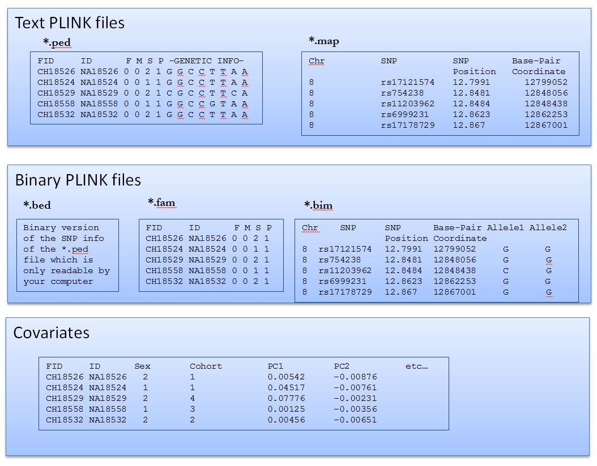

# Lab 2. Getting started with Plink

[](https://ssh.cloud.google.com/cloudshell/open?cloudshell_git_repo=https://github.com/nicolabarban/sociogenomics2023&cloudshell_tutorial=week2/lab2.md)

## Installing Plink in your system
PLINK is a free, open-source software package for genomic data analysis. It was originally designed for analyzing genetic association studies, particularly for case-control studies and family-based studies. PLINK can perform various tasks related to genetic data analysis, including data management, quality control, association analysis, haplotype analysis, and population stratification correction.

PLINK is widely used in the field of human genetics and has been cited in numerous scientific publications. It is compatible with various file formats commonly used in genetics research, such as VCF, BED, and PED formats. PLINK is available for download on the project's website and is actively maintained by a team of developers.


**Let's start from our home directory and change directory to** `Sociogenomics/Software`
```
cd $HOME
cd Sociogenomics/Software
```

PLINK is available from [here:](https://www.cog-genomics.org/plink/)
We use (for now) PLINK 1.9. Now we can download the linux version in our system

```
wget https://s3.amazonaws.com/plink1-assets/plink_linux_x86_64_20230116.zip
unzip plink_linux_x86_64_20230116.zip
```

let's check file permission. We need to make plink executable to use it as software
```
ls -l
```

Check file permissions
* chmod +rwx filename to add permissions.
* chmod -rwx directoryname to remove permissions.
* chmod +x filename to allow executable permissions.
* chmod -wx filename to take out write and executable permissions.


This is how we make the file executable
```
chmod +x plink
```

we can now execute the software using `./` in front of the file
```
./plink --help 

```

### Create symbolic links

A symbolic link, also known as a symlink or a soft link, is a type of file that acts as a pointer or reference to another file or directory in a file system.

When a symbolic link is created, it contains the path to the file or directory that it points to. When a user accesses the symbolic link, the file system follows the link and accesses the file or directory that it points to, as if the user had accessed it directly.

Symbolic links are often used in Unix-based operating systems, such as Linux or macOS, to create shortcuts to frequently used files or directories, or to provide a simpler or more intuitive file structure. They can also be used to create multiple paths to the same file or directory, or to enable compatibility between different versions of software.


```
cd $HOME/Sociogenomics
ln -s Software/plink
```

Now we can access PLINK from this directory

```
pwd
./plink --help 
```


### Upload the file `week2.zip ` and unzip files in Data folder

```
cd Data/
unzip week2.zip
 mv week2/*.* ./


  rm -r __MACOSX/
  rm -r week2

cd $HOME/Sociogenomics
```

## How to read PLINK files




### Read Binary PLINK file

we start with PLINK binary files 


1. `.bim` file  contains info on the markers
```
head Data/hapmap-ceu.bim
```
2. `.fam` file  contains info on the individuals 
```
head Data/hapmap-ceu.fam
```

2. `.bed` files are not readable!
```
head Data/hapmap-ceu.bed
```
### Recode PLINK file


Recode into map and ped files
```
./plink --bfile Data/hapmap-ceu --recode --out Results/hapmap-ceu
```

1. `.map` file  contains info on the markers

```
head Results/hapmap-ceu.map
```

2. `.ped` file  contains info on the individual genotypes
```
head -1 Results/hapmap-ceu.ped
```


###Import VCF into plink
 A VCF (Variant Call Format) file is a standard file format used in bioinformatics to store genetic variation data, such as single nucleotide polymorphisms (SNPs) and insertions/deletions (indels), typically obtained from DNA sequencing. It contains information about the genomic location, alleles, genotype, and quality score of each variant called.

```
./plink --vcf  Data/ALL.chr21.vcf.gz --make-bed --out Results/test_vcf
```


### Select individuals
```
./plink --bfile Data/hapmap-ceu \
        --keep Data/list.txt \
        --make-bed --out  Results/selectedIndividuals

```

### Select individuals with genotype at least 95% complete
We can select individuals based on the completness of their genotype
```

./plink --bfile Data/hapmap-ceu --make-bed --mind 0.05 --out Results/highgeno
```


### Select specific markers

In this way we select only a specific marker, in this case SNP `rs9930506`
```

./plink     --bfile Data/hapmap-ceu \
            --snps  rs9930506 \
        	--make-bed \
            --out  Results/rs9930506sample

```

### Merge genetic files

We can merge different files (different set of individuals, in this case)
```


./plink --bfile Data/HapMap_founders \
   	   	--bmerge  HapMap_nonfounders \
		--make-bed --out Results/merged_file
```

### Add a phenotype into PLINK files

PLINK file can also store info on a phenotype
```


head Data/1kg_EU_qc.fam
```

```

head Data/1kg_EU_qc.bim
```


This file contains info on BMI of different individuals
```

head Data/BMI_pheno.txt
```

This is how we add a phenotipic information to a plink file
```


./plink      --bfile Data/1kg_EU_qc \
             --pheno Data/BMI_pheno.txt \
             --make-bed --out Results/1kg_EU_BMI

```

```
 head Data/1kg_EU_BMI.fam
```
## Descriptive Statistics

### Allele frequency
We can calculate allele frequency

```
 ./plink --bfile Data/hapmap-ceu  --freq --out Results/Allele_Frequency
```

```
head Results/Allele_Frequency.frq 
```

### Missing values

individuals
```


./plink --bfile Data/hapmap-ceu --missing --out Results/missing_data
```
variants
```

head Data/missing_data.imiss
```

Filter females
```

./plink     --bfile Data/hapmap-ceu \
            --filter-females \
            --make-bed \
            --out Results/hapmap_filter_females

```